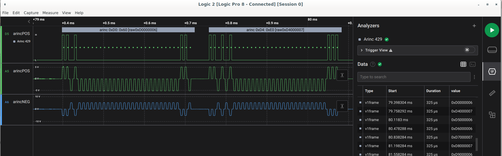

# arinc429Analyzer
ARiNC 429 Saleae plugin

Note: this project is based on a framework provided by Saleae. [https://github.com/saleae/SampleAnalyzer]


### Linux build

```bash
mkdir build
cd build
cmake ..
cmake --build .
# built analyzer will be located at build/Analyzers/libarinc429Analyzer.so
```

### copy to your Saleae plugin folder

```cp -a Analyzers/libarinc429Analyzer.so ~/saleae/myAnalyzers/ 
```

### screenshot

